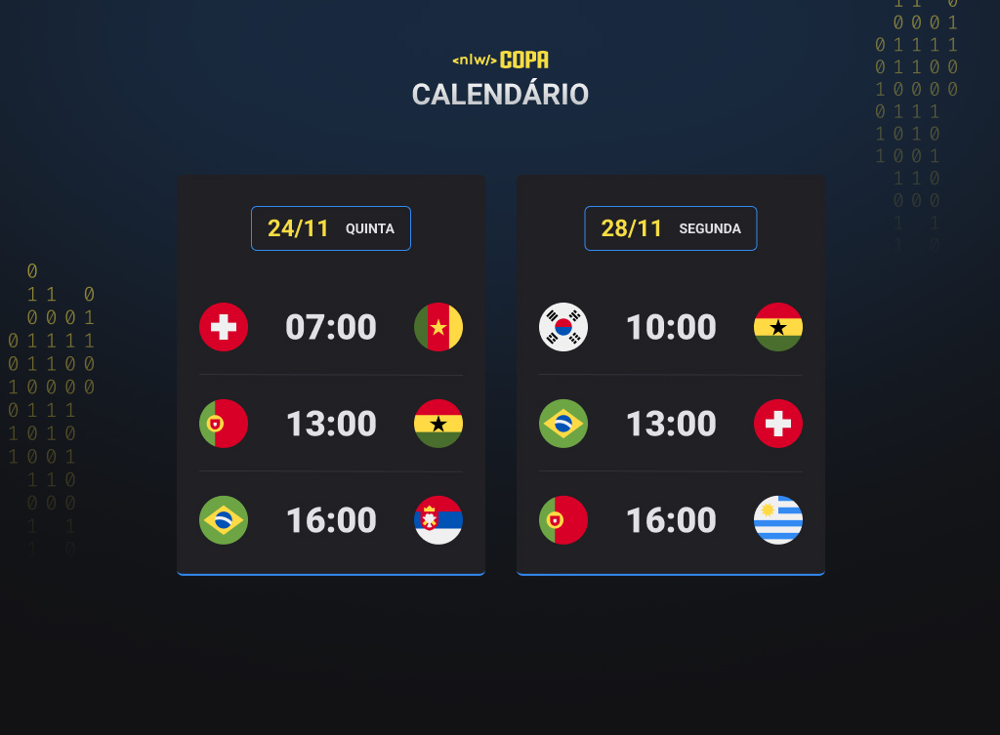

# Calendário de jogos da copa

 Trabalho realizado por meio de um curso gratuito oferecido pelo time da Rocketseat

### Tecnologias envolvidas
---
<ul>
<li>
 HTML 
</li>

<li>
 CSS 
</li>
<li>
 JavaScript 
</li>
<li>
 Git e Github 
</li>
</ul>

### Layout
---

  

  

